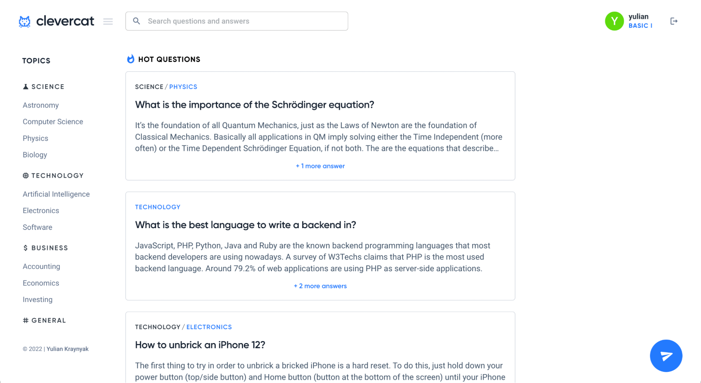
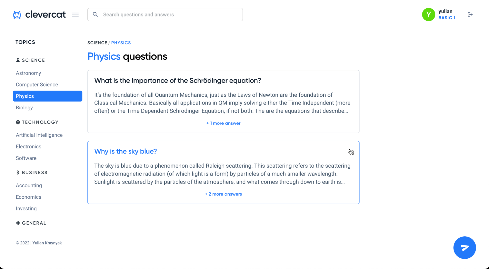
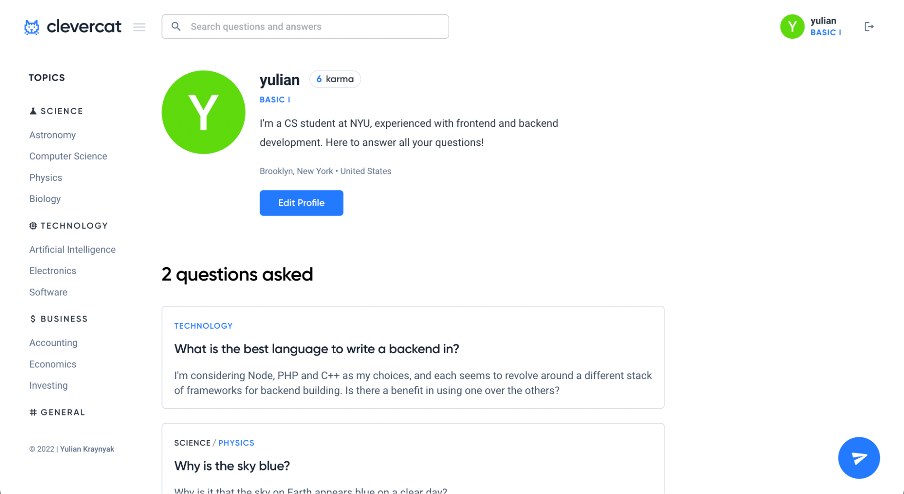
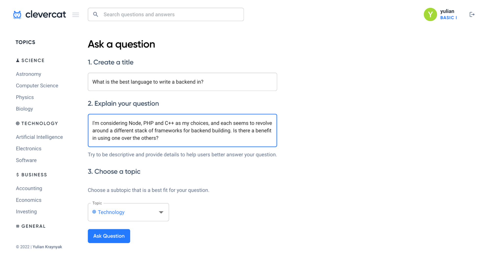
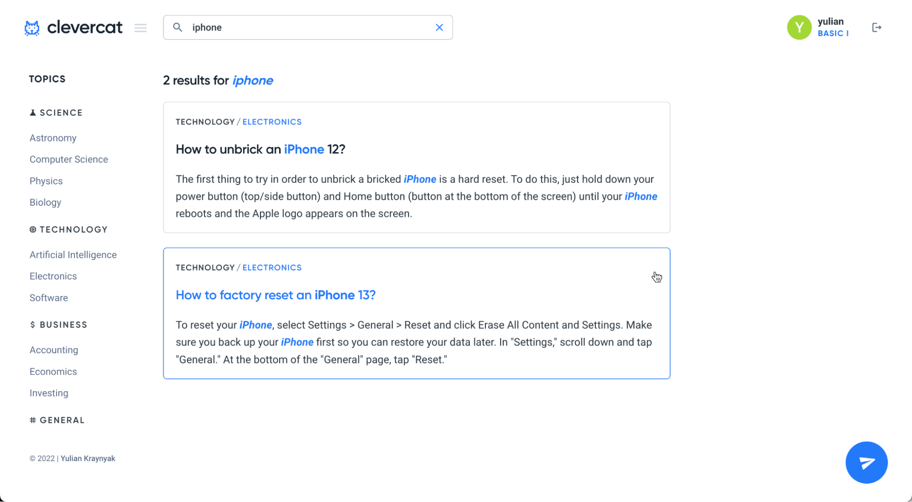
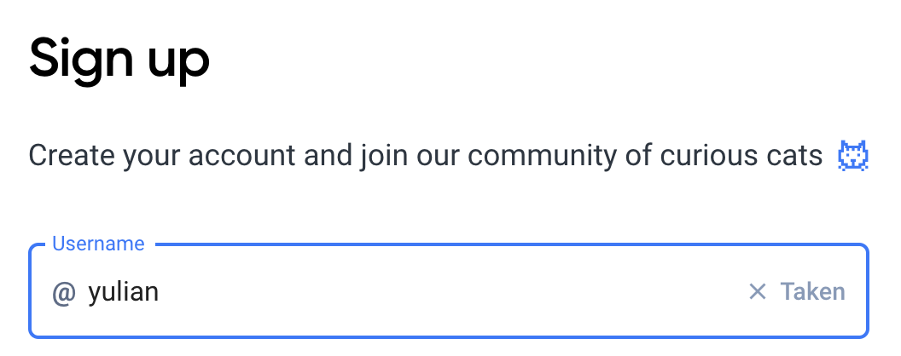
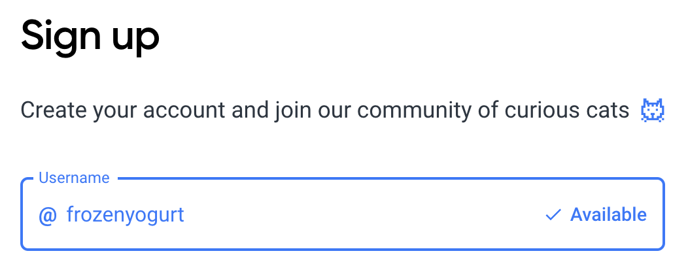

# Clevercat

Clevercat is a question-and-answer platform built with **React** + **Material UI**, **Node.js** and **Postgres**.

I built this application as my final project for my _Principles of Database Systems_ course at New York University, going beyond the basic requirements and adding a variety of additional features including user-session management, profile exploration/discovery, search by scope & relevancy, username availability validation, password hashing, as well as many more.

I've included some screenshots of the application below, but invite you to [read the full project report](https://docs.google.com/document/d/1zMaOHhK5QVISJhw-zEy4btloMn8hCeytYXa21A--pWg/edit?usp=sharing) for a more in-depth dive into the details of the project and how I went about building it.

## Screenshots

Home Screen

Browse by topic

Profile Screen

Ask (a question) Screen

Search Screen (keyword highlighting!)

Search Screen (search scoping)

Real-time username validation

 

Check out the [full project report](https://docs.google.com/document/d/1zMaOHhK5QVISJhw-zEy4btloMn8hCeytYXa21A--pWg/edit?usp=sharing) for more screenshots and more technical frontend/backend details.

 
